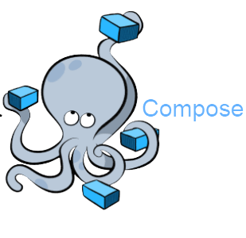
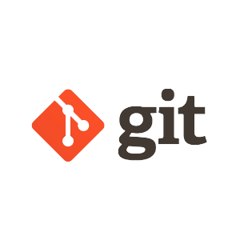
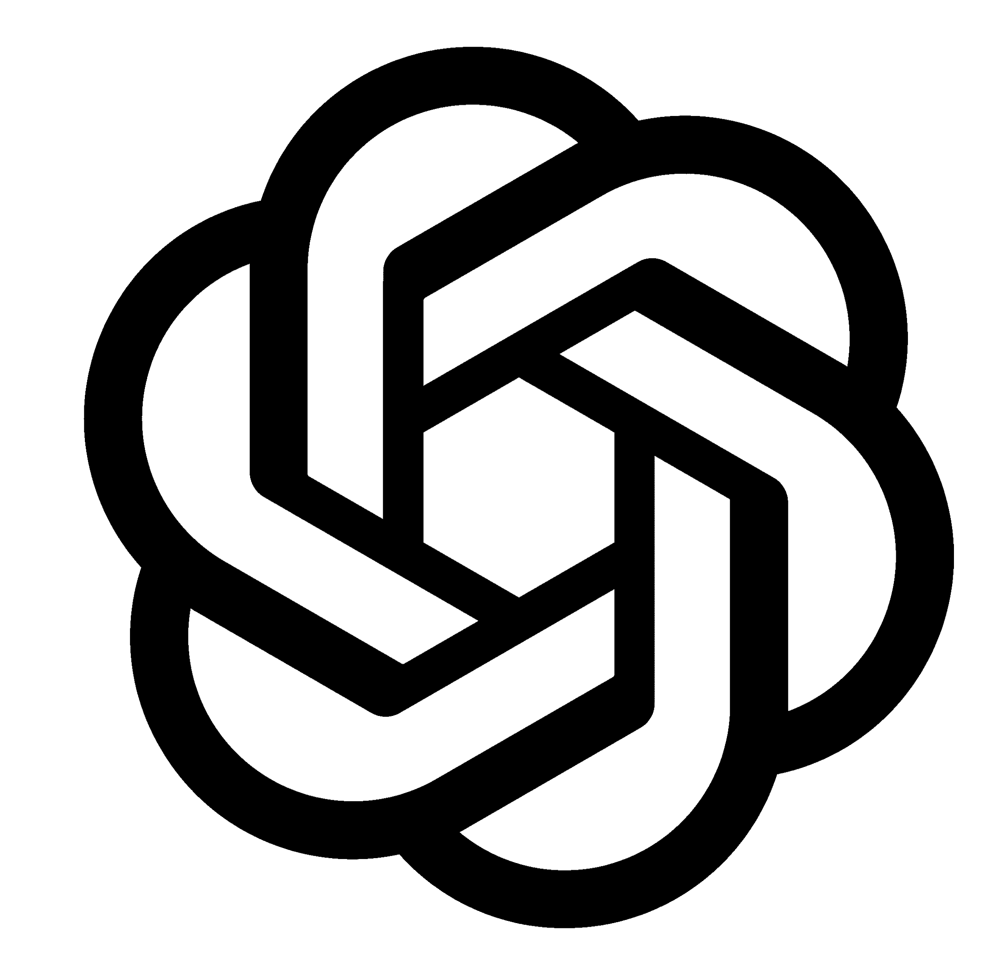
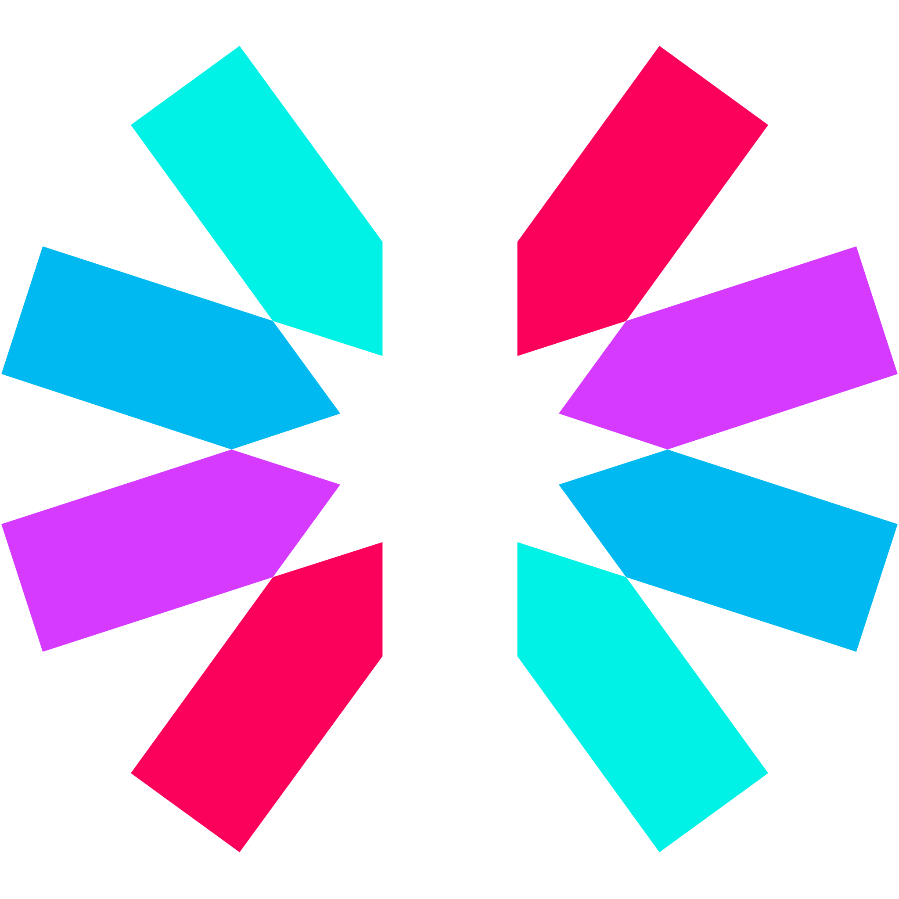

## Hi (Привет) 👋

<h4>Programming Languages (Языки программирования): </h4>

	 
	 
	 

<h4>Skills and Tools (Инструменты): </h4>

	 
	
	
	
	
	
	
	 
	 
	 
	 
	   
	 
	
	
	 
	   
	 
	  
	 

<h4>Desktop Environment (Среды разработки): </h4>

	
	

<h4 align="center"> Higher education (Высшее образование)🎓:</h4>

  	Togliatti State University (Bachelor degree) 2024 | Тольяттинский государственный университет (бакалавриат) 2024

<h4 align="center">Contacts (Связь со мной): </h4>

	
	

